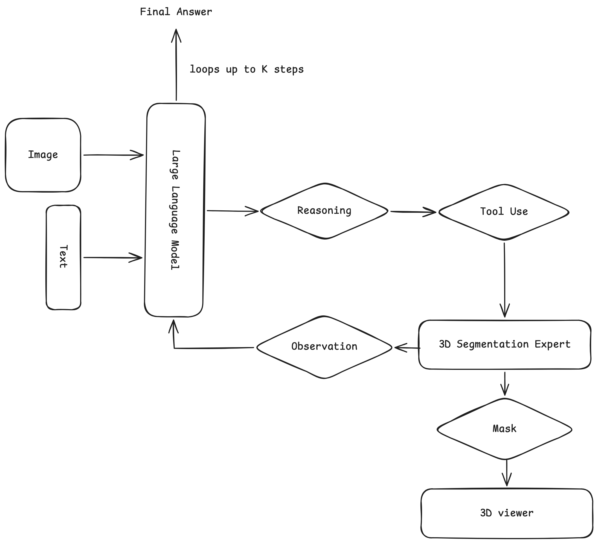
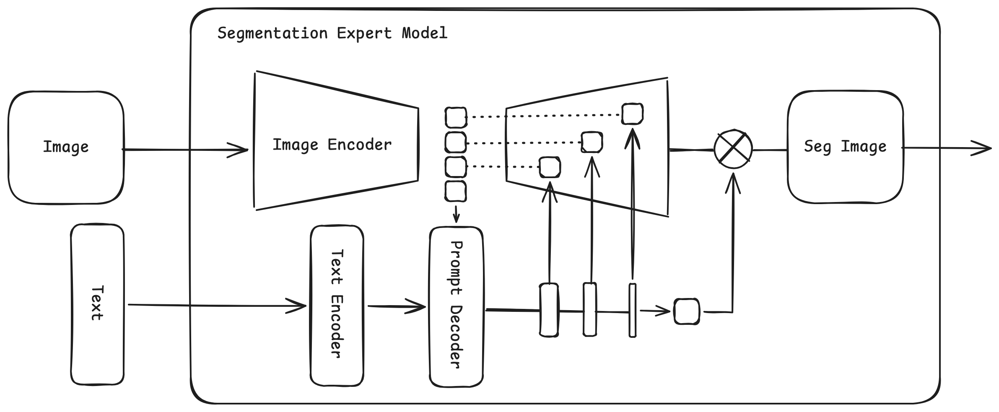

# SegAgent

A reasoning-segmentation agent that composes two **pretrained** models.
**Qwen2.5-VL-7B** is the planner: it reasons step by step and calls **VoxTell** (a 3D
medical-image segmentation expert) as a tool, reading back quantitative evidence until it
can answer. The web layer adds a streaming **chain-of-thought chat panel** over the VoxTell
viewer.

> **Core technique — a ReAct loop.** All the
> capability comes from **loop engineering**: the planner runs a **ReAct** protocol —
> **Reason → Act → Observe** — interleaving chain-of-thought with `segment()` tool calls
> and feeding each result back before it acts again.




- **Segmentation Expert Model** = **VoxTell** (unchanged — we reuse the plugin's loaded `predictor`).
- **Large Language Model** = **Qwen2.5-VL-7B-Instruct**, used **zero-shot** as a ReAct
  tool-caller. Both models are pretrained and frozen.
- The web UI gains a **chat panel** that streams the **chain of thought**, tool calls,
  observations, and the final answer; masks the agent produces are overlaid in the
  existing NiiVue viewer.

## What's in here

| File                                             | Goes to (in `voxtell-web-plugin/`)      | Notes                                                                 |
| ------------------------------------------------ | --------------------------------------- | --------------------------------------------------------------------- |
| `segagent/backend/agent.py`                      | `backend/agent.py`                      | **new** — the agent loop (Qwen2.5-VL ↔ VoxTell)                       |
| `segagent/backend/server.py`                     | `backend/server.py`                     | **drop-in replacement** — adds `/chat` (NDJSON stream) + `/mask/{id}` |
| `segagent/frontend/src/components/ChatPanel.tsx` | `frontend/src/components/ChatPanel.tsx` | **new** — streaming chat + CoT UI                                     |
| `segagent/frontend/src/App.tsx`                  | `frontend/src/App.tsx`                  | **drop-in replacement** — mounts the chat panel, overlays agent masks |
| `segagent/requirements-segagent.txt`             | —                                       | extra Python deps to `pip install`                                    |

`server.py` and `App.tsx` are the plugin's originals with only SegAgent additions,
so you can diff them against your checkout before copying.

## Install (on the server — nothing is built on your laptop)

Assumes you already followed the [voxtell-web-plugin README](https://github.com/gomesgustavoo/voxtell-web-plugin)
(conda env `voxtell`, PyTorch, `pip install -e .`, `python download_model.py`).

```bash
# 1. clone the base web plugin AND this repo on the server
git clone https://github.com/gomesgustavoo/voxtell-web-plugin.git
git clone https://github.com/Syndr0/SegAgent.git
cd voxtell-web-plugin
conda activate voxtell            # the env you created for the plugin

# 2. copy the SegAgent files over the base repo
cp ../SegAgent/segagent/backend/agent.py                      backend/agent.py
cp ../SegAgent/segagent/backend/server.py                     backend/server.py
cp ../SegAgent/segagent/frontend/src/components/ChatPanel.tsx frontend/src/components/ChatPanel.tsx
cp ../SegAgent/segagent/frontend/src/App.tsx                  frontend/src/App.tsx

# 3. extra python deps (Qwen2.5-VL etc.)
pip install -r ../SegAgent/segagent/requirements-segagent.txt

# 4. run (backend :8000, frontend :5173) — same as the base plugin
./run.sh
```

The frontend needs **no new npm packages** — `lucide-react` (already a dependency)
provides every icon used.

> First `/chat` call downloads Qwen2.5-VL-7B (~16 GB) from Hugging Face and loads it;
> the model is loaded **lazily**, so the server still starts fast and plain
> `/predict` segmentation keeps working even before the LLM is ready.

## Hardware

Running all three models at once (Qwen2.5-VL-7B + VoxTell + Qwen3-Embedding-4B):

- **Recommended: a single 24–48 GB GPU** (RTX 4090 / A5000 / A100). Peak ≈ 24 GB.
- The base plugin's low-VRAM tricks (fp16 text encoder, CPU sliding-window offload)
  still apply.

### Fit on a smaller GPU (optional 4-bit)

`pip install bitsandbytes`, then in `agent.py::_ensure_llm` swap the load for:

```python
from transformers import BitsAndBytesConfig
self.model = Qwen2_5_VLForConditionalGeneration.from_pretrained(
    QWEN_MODEL_ID,
    quantization_config=BitsAndBytesConfig(load_in_4bit=True,
                                           bnb_4bit_compute_dtype=torch.bfloat16),
    device_map="auto",
).eval()
```

That brings Qwen2.5-VL to ~6 GB.

## Configuration (env vars, all optional)

| Var                       | Default                       | Meaning                                                |
| ------------------------- | ----------------------------- | ------------------------------------------------------ |
| `SEGAGENT_LLM`            | `Qwen/Qwen2.5-VL-7B-Instruct` | planner model id                                       |
| `SEGAGENT_MAX_STEPS`      | `6`                           | max reason→segment iterations before forcing an answer |
| `SEGAGENT_MONTAGE_SLICES` | `6`                           | how many axial slices Qwen sees for grounding          |
| `SEGAGENT_MAX_NEW_TOKENS` | `512`                         | generation budget per step                             |

## How it works — the ReAct loop

1. `/chat` receives the volume + a question, extracts `N` windowed axial slices, and
   hands them to Qwen2.5-VL with a **ReAct** system prompt.
2. Each turn Qwen replies `THOUGHT: … / ACTION: segment("…")` **or** `THOUGHT: … / FINAL: …`.
3. On an `ACTION`, the backend runs VoxTell on the **full 3D volume**, computes
   statistics (voxel count, mL, mean intensity, bbox), saves the mask, and feeds the
   stats back as an `OBSERVATION`.
4. Events stream to the browser as NDJSON; `ChatPanel` renders the chain of thought
   live and overlays each mask via `/mask/{id}`.
5. When Qwen emits `FINAL` (or hits `SEGAGENT_MAX_STEPS`), the answer is shown.

## Design notes

- **Pretrained and frozen.** Qwen is a planner/interpreter; VoxTell does the
  segmentation. The LLM never needs a `<SEG>` token — the two models
  are decoupled through a **text tool-call interface**, which is exactly why no extra
  training is required.
- **3D vision into a 2D LLM.** Qwen2.5-VL is 2D, so it "sees" the volume through a few
  representative slices. VoxTell — not Qwen — is what actually understands the 3D data,
  so slice grounding only needs to be good enough for the _planning_ decisions.
- **Determinism.** Generation is greedy (`do_sample=False`) for reproducible traces.
- Prompts should use anatomy VoxTell knows (organs, substructures, some lesions). The
  system prompt already steers the model toward these.
